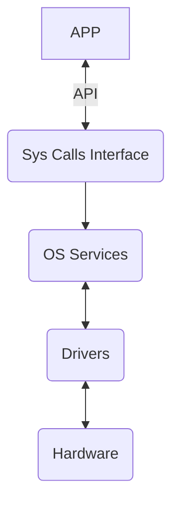

#OS #linux

## OS

[Введение в архитектуру ЭВМ. Элементы операционных систем.](https://stepik.org/course/253 "Введение в архитектуру ЭВМ. Элементы операционных систем."]https://stepik.org/lesson/13481/step/6?unit=3637)

[# Архитектура ЭВМ](https://www.youtube.com/watch?v=ykUmmfZ_LxY&list=PLnseyzyGdZdfv8H7LkvyVVE33fbBZaSdH&index=1&ab_channel=IndustrialSoftwareEngineeringOnline)

CPU 
читает память и исполняет инструкции

Простейшая схема компьютера
	![[Pasted image 20231208220137.png]]

Two types of usage - I/O and computation

I/O
	раньше вводили через перфокарты в память
	сейчас приложение вводит в память

OS function for Apps
	Abstraction layer for hardware
	Common usage of CPU and memory by many apps
	Isolation apps to error handling
	Переносимость данных между приложениями

OS provide very useful ***abstractions*** for developers
	Процессы и потоки ???
	Адресное простравнство и память
	Files and file system
	Сокеты, протоколы???
	Устройства

OS provide API(Application Programming Interface) for apps
System calls

Hello World System Calls [[Bash]] made syscalls
	![[Pasted image 20231208162417.png]]

Kernel только реагирует
	Handle sys calls from app
	Handle sys calls from hardware
	Processes scheduling(allow many processes use one CPU)
	Handle apps exceptions
	Clear after app finish

OS Manage via Services
	Process (start, stop, etc)
	Memory 
	Files
	Security model ????
	Etc (terminal, network, timers, hardware)
	IPC - inter process communication
	
	![[Pasted image 20231208222620.png]]

### Что такое процесс ?
Выделенное OS пространство для app
позволяет не думать что другие процессы тоже используют
эти ресурсы

Process (Иллюзия персональной абстрактной машины) 
(контейнер ресусов)
- Адресное пространство ???
	  Процесс работает в своем адр простр
	  Физ адресс - адр на шине памяти
	  Логический адресс - тем который опер процесс ????(селектор смещения ????)
	  Указатель состоит ( где сегментный регистр начало и offset (смещение)  ?) ?????
	  Вирт память (сброс на диск, paging) ???
	  Линейный адресс ????
	  
- CPU 
- Files and other abstraction
	- Очень широкая абстракция - можно читать/писать
	  Пространство имен
- State ? (состояние памяти и регистров процессора)
- Stack ? (часть памяти)

Поток(Threads) (поток исполнения ?) (набор инструкций CPU)
(пользуются ресурсами процессами)

Состояние процесса 
	Active (на процессоре)
	Wait
	Ready

***?????***
В линукс процесс это группа потоков которая шарят память ...
т.е. потоки имеют общая адресное пространство
***?????***

		Cons:Треды нужно упорядочивать !!!
		Вытесняющая многозадачность ?

### Прерывание - сигнал на CPU
 проц тормозит и выполняет специальную процедуру
 обработчик прерывания((ISR, [англ.](https://ru.wikipedia.org/wiki/%D0%90%D0%BD%D0%B3%D0%BB%D0%B8%D0%B9%D1%81%D0%BA%D0%B8%D0%B9_%D1%8F%D0%B7%D1%8B%D0%BA "Английский язык") Interrupt Service Routine))
 
 Виды 
- Прерывания от hardware 
- System call - от приложения (открыть файл)
- Исключение - например обращение к несуществующему адресу в памяти

Interrupt request (можно ли выполнить прерывание ?)
(контроллер прерываний)

System Calls and drivers

![[Pasted image 20231208195237.png]]

##### Три главных сервиса OS
	Планировка задача - обеспечить Многозадачность 
	Управление памятью
	Обеспечение межпроцессорного взаимодействия

Процесс загрузки
		BIOS маленькая операционная система
		процессор при подаче питания начинает исполняет
		инструкции с какого то места(жестко прошитая память)
		POST
		BIOS(basic i/o system) - может найти накопитель для загрузки
		читает блок и пишет в память и передает управление
		(загрузчик)

#### Прерывание таймера
Создается первый процесс пользователя
(но создает таймер - верни управление ***планировщику задач***)
каждые 20мс OS возвращает себя управление

#### Переключение контекста  CPU ???
Чтобы продолжить исполнение - ОС сохраняет стейт(в регистрах) процессора в памяти
и возвращает когда передает процессу управление обратно

Переключение контекста схема
	![[Pasted image 20231208202703.png]]
#### ???? План блокировок (при нескольких CPU)

#### Освобождение ресурсов после смерти процесса

![[Pasted image 20231209175345.png]]

Бит - 0 или 1
Байт - 8 бит
байт мин уровень адрессация

word - 32/64 бита

максимальный адресс

адресс 
$$
2^{64} бит
$$ 

регистры общега используются для
переменные/параметры/результаты вычисления

специальные регистры

Режим работы
	Реальных адр 16бит
	Защищенный 32 бит
	64 разрядный
Уровни доступа
Три уровня(0 OS/1,2 драйвера, app3)

Адрес памяти 
Логический адрес : адрес начала сегмента : смещение сегмента

Физический VS логический адресс ??????

